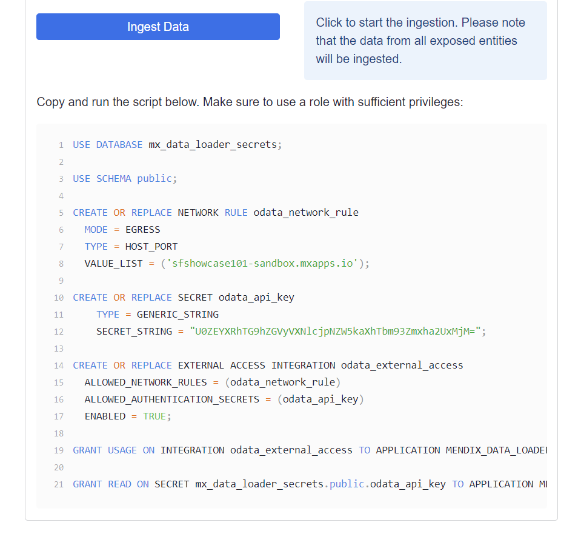
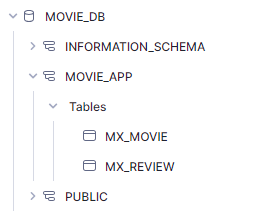

author: Trong Tran
id: mendix_data_loader
summary: Guide on how to use the Mendix Data Loader to ingest data from Mendix applications via a published OData service.
categories: connectors,partner-integrations
environments: web
tags: Connectors, Native Apps, External connectivity, Mendix

# Ingest data from Mendix applications

## Overview
Duration: 1

In this tutorial you will learn how to ingest data from a Mendix application. In the following steps you will learn how to configure the Mendix Data Loader component, a Snowflake application that is deployed in your Snowflake environment that ingests your Mendix data.

[Mendix](https://www.mendix.com) is the leading platform in the low-code application development domain. The data structure for the application is retrieved and the transient target tables for the data ingestion are created dynamically.


### Prerequisites

- Mendix account, if you don't have one sign up [here](https://signup.mendix.com/)
- Mendix Studio Pro ([10.10](https://marketplace.mendix.com/link/studiopro/10.10.0) or later)
- Snowflake user with `ACCOUNTADMIN` role to install the Mendix Data Loader

### You will learn

- How to install the Mendix Data Loader
- How to ingest operational Mendix application data into Snowflake
- How to join associated tables

## Set-up your Mendix application
Duration: 15

### Deploy your first Mendix application
- Download the Snowflake Showcase App from the [Mendix Marketplace](https://marketplace.mendix.com/link/component/225845)
- Once downloaded, execute the file titled `SFShowcase.mpk`, a window prompt should appear
- Create a new folder and select it to unpack the project files. After unpacking, the project should appear in Mendix Studio Pro
- Inside Mendix Studio Pro, navigate to `Version Control`, then click `Upload to Version Control Server...` and confirm by clicking `OK`. A window titled Upload App to Team Server should appear
- After the project has been uploaded to version control server, click `Publish`
- After a while a snackbar notification is displayed `Your application is published`
- Click `View App` to see the login screen for your Mendix application
  - (Optional) To log into your Mendix application
    - Use the username `demo_user`
    - To retrieve the password for this user inside Mendix Studio Pro, navigate to `App 'SFShowcase'` -> `Security` -> `Demo users` -> `demo_user` and then click the link that reads `Copy password to clipboard`
- Save the endpoint of your Mendix application, you'll need it later
  - Save `https://sfshowcase101-sandbox.mxapps.io/` if your endpoint is `https://sfshowcase101-sandbox.mxapps.io/login.html?profile=Responsive` 
- You have succesfully deployed the Snowflake Showcase App onto a free cloud sandbox environment!


### About this Mendix application
The application you just downloaded, uploaded to Mendix' version control server and deployed on a free cloud sandbox environment is a free application available on the [Mendix Marketplace](https://marketplace.mendix.com/). Its purpose is to enable, aid and inspire its users on how to tackle integration with Snowflake from the Mendix domain. This application has some pre-installed operational data to showcase the Mendix Data Loader. The pre-installed data is about movies and reviews corresponding to the movies.

## Install the Mendix Data Loader
Duration: 5

- Download the Mendix Data Loader from the [Snowflake Marketplace](https://app.snowflake.com/marketplace/listing/GZTDZHHIDN/mendix-mendix-data-loader)
- Once a window displaying "Succesfully Installed" appears, click `Done`, navigate to `Data Products` -> `Apps` -> `Mendix Data Loader`, a documentation page titled `Mendix Data Loader` should appear
- You have succesfully deployed the Mendix Data Loader into your Snowflake environment!

### How will the Mendix Data Loader interact with the Mendix application?
The Mendix application has a [published OData service](https://docs.mendix.com/refguide/published-odata-services/) that exposes the application data for the entities (class definitions) captioned `Movie` and `Review` which are linked to one another through an association. The OData resource for this application can be found along the following path: `Showcase_DataLoader` -> `Resources` -> `Published OData` -> `POS_Movies`.

In the OData resource, the `General` tab contains information about the exposed service and the entities that are exposed in the service. Each entity has an endpoint from where the values can be retrieved after authentication. In the `Settings` tab, the metadata endpoint contains information about the exposed data structure of the OData resource. Additional endpoints are exposed for each exposed set configured in the `General` tab.

The Mendix Data Loader retrieves the exposed data structure from the metadata endpoint. After which the application will start to provision the application with transient tables. Then the application retrieves the data from the service feed for each exposed entity found in the metadata. The Mendix Data Loader is developed for the extraction and loading of Mendix data, any data transformation and integration should be performed outside the scope of the Mendix Data Loader's objects.

All the exposed data will be ingested into Snowflake. To retrieve a subset of the exposed data you can use the filter query option, for more information refer to [OData's Basic Tutorial](https://www.odata.org/getting-started/basic-tutorial/).

Should any data reside in the specified database and schema from prior ingestion jobs, this data will be lost. For ingestions of multiple sources, we recommend using the same database with a different schema.


## Mendix Data Loader configuration
Duration: 5

### Starting the application
Upon starting the application, a documentation page that includes usage instructions is displayed. To start the application, click the `MENDIX_DATA_LOADER` hyperlink in the header.

### Granting the application privileges
The Mendix Data Loader requires the `CREATE DATABASE` privilege to create the target database, this is where the data is ingested towards. To that end, a modal window will request you to grant the application these privileges, click `Grant Privileges` to accept this request.

Next, the application requires a `NETWORK RULE`, `SECRET` and `EXTERNAL ACCESS INTEGRATION` objects to make the external call towards your deployed Mendix application instance. To create these objects, fill in the form of the application as follows:

- `Endpoint`: The location of the OData resource `{{YOUR_SAVED_ENDPOINT}}/odata/Movies/v1/`, e.g., `https://sfshowcase101-sandbox.mxapps.io/odata/Movies/v1/`
- `Username`: SFDataLoaderUser
- `Password`: MendixSnowflake123
- `Target database name`: MOVIE_DB
- `Target schema name`: MOVIE_APP

Then click the `Generate Access Script` button and copy the value of the generated field. This button uses the values from the fields to create a SQL script that a user with the `ACCOUNTADMIN` role needs to execute. This script will create the objects in the database titled `mx_data_loader_secrets` and grant the application privileges to access those objects.



Open a new browser tab, log into the same Snowflake environment and create a new SQL worksheet. In here, paste the copied SQL script and hit the `CTRL` + `SHIFT` + `ENTER` buttons on your machine simultaneously. The execution of commands may take a few moments and should result into a table with a single column captioned `status` and one row with the status value "`Statement executed successfully.`" should appear.

You have now successfully granted the Mendix Data Loader with the privileges and objects it needs to ingest data from your specified endpoint.

### Start the ingestion
Move back to the initial browser tab in which you had opened the Mendix Data Loader. If the input fields have the same values as the ones that you specified for the access script generation, you can now click the `Ingest Data` button. If not, go back one step and specify the values in the form of the application again and then click the `Ingest Data` button.


## Join associated tables
Duration: 5

You can view the ingested data along the following path: {{SPECIFIED_TARGET_DATABASE}}.{{SPECIFIED_TARGET_SCHEMA}}, e.g., MOVIE_DB.MOVIE_APP.



In Mendix, the data structure is modeled as following:


After the data ingestion, you will have a table for each distinct exposed entity. For the entities that have an association (object reference) with another entity, a foreign key is included provided that this has been configured in the published OData service. In this exercise, you'll be be joining the two distinct entity tables using the foreign key.

Create a new SQL worksheet. Copy the code snippet below and execute the script. In case you specified different names than `MOVIE_DB` for the target database and `MOVIE_APP` for the target schema, update the SQL script accordingly.

```
USE DATABASE MOVIE_DB;
USE SCHEMA MOVIE_APP;
SELECT NAME as "Movie Name", MX_REVIEW.REVIEWTEXT as "Review"
  FROM MX_MOVIE
  INNER JOIN MX_REVIEW ON MX_REVIEW.MOVIE=MX_MOVIE.ID;
```

The result should display a joined table containing 56 rows. Each row displays the name of the movie and review that corresponds to the movie.


## Conclusion
Duration: 2

You made it! By now, you should be able to deploy a Mendix application to a sandbox environment, install the Mendix Data Loader and join two distinct entity tables.

For additional information about the Mendix Data Loader, refer to [Mendix Data Loader | Mendix Documentation](https://docs.mendix.com/appstore/modules/snowflake/mendix-data-loader/).
